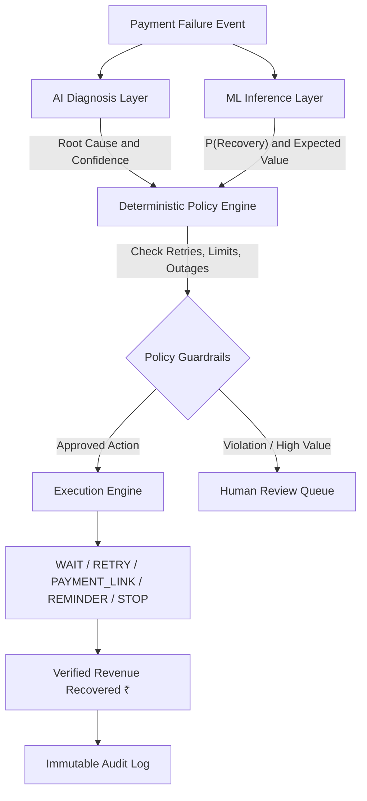

# RecoveryOS — Autonomous AI Revenue Recovery Agent


**RecoveryOS** is a policy-aware, autonomous AI Revenue Recovery Operating System for payment merchants. Instead of blindly retrying every failed payment, RecoveryOS sits between payment failure webhooks and recovery actions to intelligently diagnose errors, predict recovery probabilities, enforce deterministic merchant policies, execute bounded actions, and prove actual revenue recovered.

📖 **For in-depth architecture diagrams, mathematical formulations, and complete system specs, see [docs/DOCUMENTATION.md](docs/DOCUMENTATION.md).**

---

## Architecture



---

## Core Features

- **XGBoost Recovery Probability Prediction**: Evaluates payment telemetry (bank switch latency, customer LTV, retry attempts, rail limits) to predict $P(\text{recovery})$ with calibrated confidence.
- **Explainable AI (SHAP TreeExplainer)**: Generates local feature attributions showing positive and negative signals driving every prediction.
- **Deterministic Merchant Policy Engine**: Hard guardrails that cannot be hallucinated by LLMs:
  - Bounded actions: `WAIT`, `RETRY`, `PAYMENT_LINK`, `REMINDER`, `HUMAN_REVIEW`, `STOP`.
  - Max automated retries ($\le 2$).
  - High-value threshold escalation ($\ge ₹50,000$).
  - Automatic suppression after 3 consecutive failures to avoid customer friction.
- **Systemic Rail Outage Safeguard**: Detects failure spikes (e.g. transient bank outages) and pauses customer outreach automatically, avoiding thousands of unnecessary contacts.
- **Batch Simulation Engine**: Simulates and benchmarks complete recovery pipelines across 10,000+ synthetic transactions against naive retry baselines.
- **Full-Stack SaaS Platform**: Command Center overview, real-time Recovery Queue, Case Details with SHAP attribution, live Agent Activity stream, ROI Analytics, and an Immutable Audit Log.

---

## Directory Structure

```
recovery-agent-os/
├── frontend/                     # React + TanStack Start / Vite UI
│   ├── src/
│   │   ├── api/client.ts         # Typed REST API Client
│   │   ├── components/           # Dashboard & Operations UI Components
│   │   ├── lib/                  # Formatting & Utilities
│   │   └── routes/               # Application Routes
│   ├── package.json
│   ├── vite.config.ts
│   └── Dockerfile
│
├── backend/                      # Python + FastAPI REST API & Worker
│   ├── app/
│   │   ├── api/v1/endpoints/     # REST Endpoints (Overview, Cases, Analytics, Policies, Audit, ML)
│   │   ├── core/                 # Config, Database Engine, Celery App
│   │   ├── models/               # SQLAlchemy Models (Transaction, Case, Policy, Audit, Activity)
│   │   ├── schemas/              # Pydantic Schemas
│   │   ├── services/             # Policy Engine, AI Diagnosis, ML Inference, Simulation
│   │   ├── tasks/                # Celery Background Tasks
│   │   └── main.py               # FastAPI Entrypoint
│   ├── alembic/                  # Database Migrations
│   ├── tests/                    # Pytest Suite
│   ├── requirements.txt
│   └── Dockerfile
│
├── ml_pipeline/                  # Machine Learning & Data Pipeline
│   ├── data_generator.py         # 10K+ Realistic Payment Transaction Synthesizer
│   ├── features.py               # Scikit-learn ColumnTransformer & Preprocessors
│   ├── train.py                  # XGBoost & Baseline Model Training
│   ├── explainer.py              # SHAP TreeExplainer Local Attribution
│   ├── pipeline.py               # Unified Training Runner
│   └── models/                   # Serialized .joblib Models & Metadata
│
├── docker-compose.yml            # Full Stack (PostgreSQL, Redis, API, Worker, Frontend)
└── README.md
```

---

## Tech Stack

| Layer | Technologies |
|---|---|
| **Frontend** | React 19, TanStack Start & Router, Tailwind CSS, Recharts, Lucide Icons |
| **Backend** | Python 3.11+, FastAPI, SQLAlchemy, Alembic, Pydantic |
| **Data & Async** | PostgreSQL 16, Redis 7, Celery |
| **Machine Learning** | Scikit-Learn, XGBoost, SHAP, Joblib, Pandas, NumPy |
| **DevOps** | Docker, Docker Compose |

---

## Getting Started

### Prerequisites
- [Docker & Docker Compose](https://www.docker.com/) OR
- Python 3.11+ & [Bun](https://bun.sh/) / Node.js 20+

---

### Option 1: Run with Docker Compose (Recommended)

Start the full stack (PostgreSQL, Redis, FastAPI Backend, Celery Worker, and Frontend) with a single command:

```bash
docker-compose up --build
```

- **Frontend Application**: `http://localhost:5173`
- **FastAPI Interactive Docs**: `http://localhost:8000/docs`

---

### Option 2: Local Development

#### 1. Setup & Train the ML Model
```bash
# Install Python dependencies
pip install -r backend/requirements.txt

# Synthesize 10K+ dataset, train XGBoost model, and generate SHAP explainer
python -m ml_pipeline.pipeline
```

#### 2. Start the Backend API
```bash
uvicorn backend.app.main:app --host 0.0.0.0 --port 8000 --reload
```

#### 3. Start the Frontend Application
```bash
# Install frontend dependencies
bun install   # or npm install

# Start development server
bun run dev   # or npm run dev
```

---

## Running Tests

Run the backend unit tests and API integration test suite:

```bash
# Run all tests
pytest backend/tests

# Run policy engine tests
pytest backend/tests/test_backend.py

# Run REST API integration tests
pytest backend/tests/test_api.py
```

---

## REST API Overview

| Method | Endpoint | Description |
|---|---|---|
| `GET` | `/api/v1/overview` | Dashboard KPIs, 7-day trend curve, failure breakdowns |
| `GET` | `/api/v1/cases` | Filtered & paginated recovery cases |
| `GET` | `/api/v1/cases/{id}` | Detailed case diagnosis, ML SHAP factors & policy checks |
| `POST` | `/api/v1/cases/{id}/action` | Execute operator action / human review approval |
| `GET` | `/api/v1/activity` | Live AI agent operation feed & operational counters |
| `GET` | `/api/v1/analytics` | Incremental revenue lift & baseline comparisons |
| `GET` | `/api/v1/policies` | Current merchant guardrails & policies |
| `PUT` | `/api/v1/policies` | Update guardrail thresholds in real-time |
| `GET` | `/api/v1/audit` | Searchable, immutable decision audit log |
| `POST` | `/api/v1/simulation/run` | Execute 10K+ transaction simulation pipeline |
| `POST` | `/api/v1/ml/predict` | Real-time ML recovery prediction & SHAP attribution |
| `GET` | `/api/v1/ml/info` | Trained ML model metadata, features & evaluation metrics |

---


