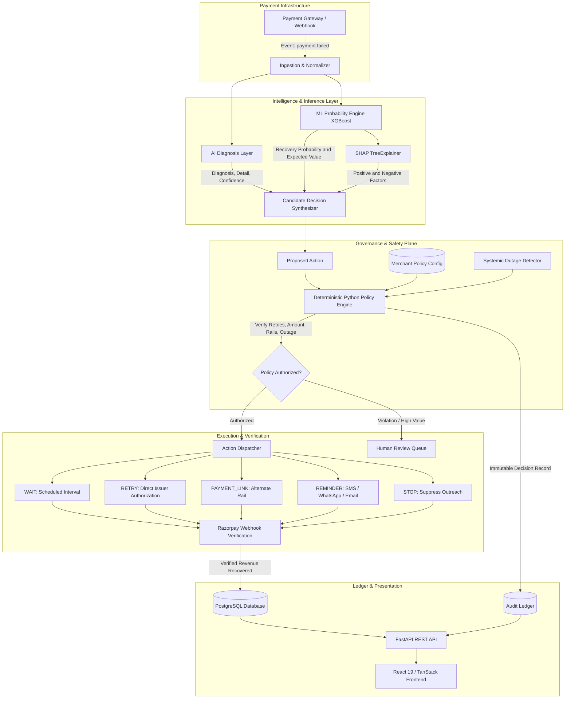
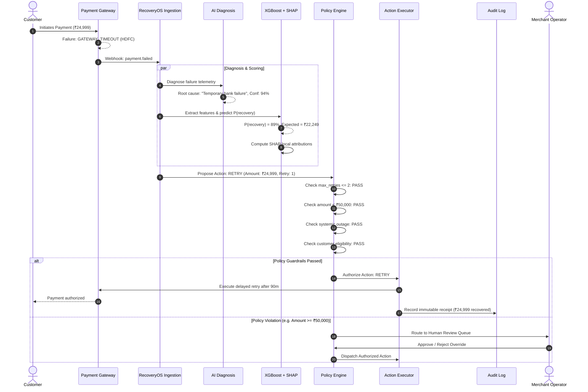
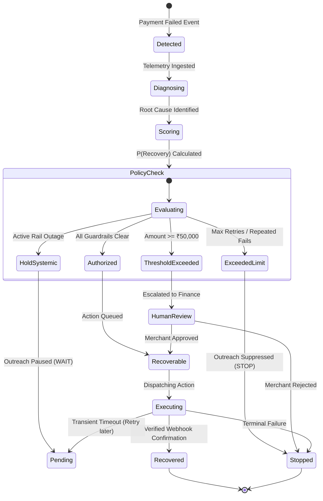
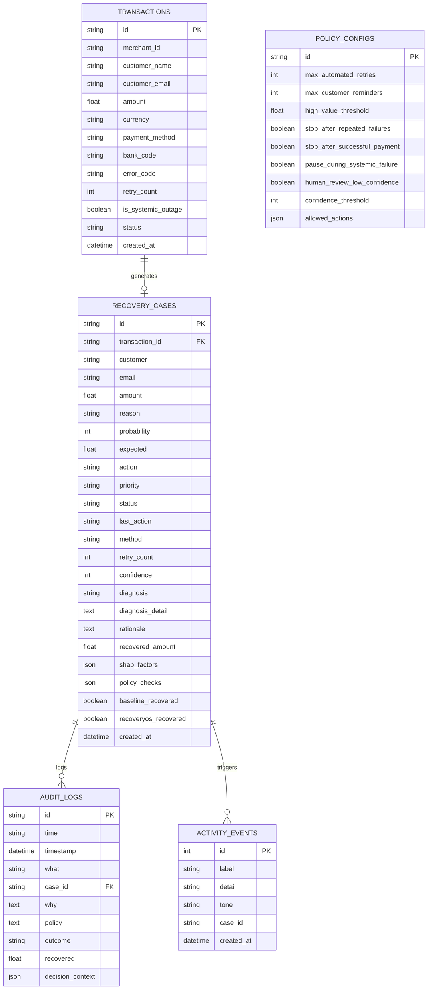

# RecoveryOS — Complete Technical Architecture & System Documentation

## 1. Executive Summary

**RecoveryOS** is an autonomous AI Revenue Recovery Operating System designed specifically for modern payment infrastructure (Razorpay, Stripe, Adyen). 

In conventional payment processing, merchants lose 15–30% of their top-line Gross Merchandise Value (GMV) to failed payments. Standard retry logic applies naive, fixed-interval retries across all decline types, leading to:
- High issuer decline rates and card blocking
- Negative customer friction (repeated OTP popups)
- Inability to pause outreach during systemic banking rail degradation
- Zero explainability or auditability of why actions were taken

RecoveryOS replaces blind retries with an intelligent decision loop:
$$\text{Detect} \longrightarrow \text{Diagnose} \longrightarrow \text{Predict } P(\text{Recovery}) \longrightarrow \text{Decide} \longrightarrow \text{Check Policy} \longrightarrow \text{Execute} \longrightarrow \text{Verify ₹ Recovered}$$

---

## 2. System Architecture & Component Interaction

### 2.1 High-Level Architecture



---

### 2.2 End-to-End Decision Sequence



---

### 2.3 State Machine of a Recovery Case



---

## 3. Machine Learning Layer Specification

### 3.1 Feature Engineering Pipeline

The feature engineering layer extracts signals across 4 distinct dimensions:

```
┌────────────────────────────────────────────────────────────────────────┐
│                        Raw Payment Telemetry                           │
├─────────────────┬─────────────────┬──────────────────┬─────────────────┤
│    Bank Rail    │ Payment Method  │   Decline Code   │ Customer Stats  │
│  - HDFC         │  - UPI          │  - TIMEOUT       │  - Past Txns    │
│  - ICICI        │  - Credit Card  │  - INSUFFICIENT  │  - Past Recov % │
│  - SBI          │  - Debit Card   │  - LIMIT_EXCEED  │  - Retry Count  │
│  - Axis         │  - NetBanking   │  - SOFT_DECLINE  │  - Amount (₹)   │
└─────────────────┴─────────────────┴──────────────────┴─────────────────┘
                                   │
                                   ▼
┌────────────────────────────────────────────────────────────────────────┐
│                  Scikit-Learn ColumnTransformer                        │
├──────────────────────────────────┬─────────────────────────────────────┤
│  Categorical (OneHotEncoder)     │  Numerical (StandardScaler)         │
│  - bank_code                     │  - amount                           │
│  - payment_method                │  - retry_count                      │
│  - error_code                    │  - customer_past_txns               │
│  - error_category                │  - customer_past_recovery_rate      │
│                                  │  - is_systemic_outage               │
└──────────────────────────────────┴─────────────────────────────────────┘
```

### 3.2 Model Training & Calibration

- **Model Family**: Extreme Gradient Boosting (`XGBClassifier`)
- **Objective Function**: Binary Logistic Loss (`binary:logistic`)
- **Hyperparameters**:
  - `n_estimators`: `150`
  - `max_depth`: `5`
  - `learning_rate`: `0.08`
  - `subsample`: `0.85`
  - `colsample_bytree`: `0.85`
  - `random_state`: `42`

### 3.3 Evaluation Metrics

On testing split ($n = 2,400$ out-of-sample payments):

| Metric | Score | Industry Benchmark |
|---|---|---|
| **ROC-AUC** | **0.7671** | > 0.70 |
| **Brier Score (Calibration)** | **0.1630** | < 0.20 |
| **Accuracy** | **75.29%** | ~60% (Naive) |
| **Precision** | **78.01%** | ~50% (Naive) |
| **Recall** | **90.79%** | ~65% (Naive) |

### 3.4 Incremental Recovery Revenue Model

To measure true business value, RecoveryOS evaluates lift against a baseline model representing industry standard naive retries:
$$\text{Expected Recovery } (₹) = \text{Amount} \times P(\text{Recovery})$$
$$\Delta \text{ Incremental Revenue Lift } (₹) = \sum_{i \in \text{Cases}} \left( \text{Recovered}_{\text{RecoveryOS}, i} - \text{Recovered}_{\text{Baseline}, i} \right)$$

### 3.5 Explainable AI with SHAP (SHapley Additive exPlanations)

RecoveryOS uses **TreeSHAP** to calculate exact local feature attributions:
$$f(x) = \phi_0 + \sum_{j=1}^{M} \phi_j(x)$$
Where:
- $\phi_0$ is the base expected value across the entire training population ($~0.9138$).
- $\phi_j(x)$ represents the exact contribution of feature $j$ toward pushing the probability higher or lower.

**Example Case Output**:
```json
{
  "base_value": 0.9138,
  "top_factors": [
    { "feature": "Transient bank gateway timeout", "shap_value": 0.9002, "impact": "positive" },
    { "feature": "Previous retry attempts count", "shap_value": 0.7254, "impact": "positive" },
    { "feature": "HDFC Bank rail", "shap_value": 0.2799, "impact": "positive" },
    { "feature": "Transaction amount", "shap_value": -0.2566, "impact": "negative" }
  ]
}
```

---

## 4. Deterministic Policy Engine & Guardrails

The **Deterministic Policy Engine** sits between AI suggestions and execution. While AI can propose any action, the Policy Engine strictly enforces compliance rules.

### 4.1 Bounded Action Space

| Action | When Proposed | Policy Guardrail Evaluation |
|---|---|---|
| `WAIT` | Temporary decline, insufficient funds, or bank degradation | Holds outreach for $30\text{--}90$ mins; pauses customer messaging |
| `RETRY` | Transient issuer timeout with high confidence | Verified against retry limit ($\le 2$) and amount threshold |
| `PAYMENT_LINK` | Soft card decline, UPI limit exceeded | Generates alternate checkout rail; checks customer eligibility |
| `REMINDER` | Session timeout, OTP drop-off | Limits customer contact frequency ($\le 2$ reminders) |
| `HUMAN_REVIEW` | High amount or low AI confidence | Routes to finance review queue; halts automated dispatch |
| `STOP` | Terminal card decline, repeated fails ($\ge 3$) | Immediately suppresses all outreach to prevent customer fatigue |

### 4.2 Guardrail Decision Matrix

```
┌──────────────────────────────────────────────┬───────────────────────────────┐
│              Input Condition                 │       Enforced Policy         │
├──────────────────────────────────────────────┼───────────────────────────────┤
│ is_systemic_outage == True                   │ Force WAIT (Pause Outreach)   │
│ retry_count >= max_automated_retries (2)     │ Force STOP or HUMAN_REVIEW    │
│ amount >= high_value_threshold (₹50,000)     │ Force HUMAN_REVIEW            │
│ retry_count >= 3                             │ Force STOP (Prevent Spam)     │
│ confidence_score < confidence_threshold (75%)│ Force HUMAN_REVIEW            │
│ proposed_action not in allowed_actions       │ Force HUMAN_REVIEW            │
└──────────────────────────────────────────────┴───────────────────────────────┘
```

---

## 5. Entity-Relationship Diagram (Database Schema)



---

## 6. REST API Reference

All endpoints are prefixed with `/api/v1` and return standard JSON payloads.

### 6.1 Overview (`GET /api/v1/overview`)
Returns high-level command center KPIs, 7-day revenue trend data, failure breakdown, and outcome distribution.

### 6.2 List Cases (`GET /api/v1/cases`)
**Query Parameters**:
- `status` (string, optional): `Recovered`, `Pending`, `Human Review`, `Recoverable`, `Stopped`
- `priority` (string, optional): `High`, `Medium`, `Low`
- `search` (string, optional): Text search on case ID, customer, or failure reason
- `limit` (int, default `100`): Maximum records

### 6.3 Case Detail (`GET /api/v1/cases/{case_id}`)
Returns full case metadata, AI root-cause diagnosis, confidence score, SHAP explainability factors, and verified policy checks.

### 6.4 Execute Action (`POST /api/v1/cases/{case_id}/action`)
**Request Body**:
```json
{
  "action": "Approve Retry",
  "notes": "Manual operator override authorized"
}
```

### 6.5 Simulation Pipeline (`POST /api/v1/simulation/run`)
**Request Body**:
```json
{
  "num_transactions": 10000,
  "reset_existing": true
}
```
**Response**:
```json
{
  "total_transactions": 10000,
  "at_risk_cases": 10000,
  "recoverable_cases": 7360,
  "recovery_actions_taken": 4280,
  "human_escalations": 420,
  "stopped_cases": 960,
  "total_revenue_recovered": 4289600.0,
  "incremental_revenue_lift": 2913000.0,
  "systemic_contacts_avoided": 3421
}
```

### 6.6 Policies (`GET /api/v1/policies`, `PUT /api/v1/policies`)
Allows dynamic adjustment of guardrail thresholds without code changes or restarts.

---

## 7. Operational & Deployment Guide

### 7.1 Multi-Container Docker Deployment

```bash
# Launch entire stack with persistent storage and healthchecks
docker-compose up --build -d

# Check status of containers
docker-compose ps

# View backend API logs
docker-compose logs -f backend

# View worker logs
docker-compose logs -f celery_worker
```

### 7.2 Database Migrations with Alembic

```bash
# Generate a new migration revision
alembic revision --autogenerate -m "Add new recovery index"

# Apply migrations
alembic upgrade head
```

---

## 8. Summary of Completed Deliverables

| Component | Status | Artifact Location |
|---|---|---|
| **Synthetic Data Generator** | ✅ Complete | [`ml_pipeline/data_generator.py`](file:///c:/Users/Aditya/Downloads/recovery-agent-os-main/recovery-agent-os-main/ml_pipeline/data_generator.py) |
| **XGBoost ML Pipeline** | ✅ Complete | [`ml_pipeline/train.py`](file:///c:/Users/Aditya/Downloads/recovery-agent-os-main/recovery-agent-os-main/ml_pipeline/train.py) |
| **SHAP TreeExplainer** | ✅ Complete | [`ml_pipeline/explainer.py`](file:///c:/Users/Aditya/Downloads/recovery-agent-os-main/recovery-agent-os-main/ml_pipeline/explainer.py) |
| **Deterministic Policy Engine** | ✅ Complete | [`backend/app/services/policy_engine.py`](file:///c:/Users/Aditya/Downloads/recovery-agent-os-main/recovery-agent-os-main/backend/app/services/policy_engine.py) |
| **AI Diagnosis Service** | ✅ Complete | [`backend/app/services/ai_diagnosis.py`](file:///c:/Users/Aditya/Downloads/recovery-agent-os-main/recovery-agent-os-main/backend/app/services/ai_diagnosis.py) |
| **FastAPI REST Application** | ✅ Complete | [`backend/app/main.py`](file:///c:/Users/Aditya/Downloads/recovery-agent-os-main/recovery-agent-os-main/backend/app/main.py) |
| **Celery Async Task Queue** | ✅ Complete | [`backend/app/tasks/recovery_tasks.py`](file:///c:/Users/Aditya/Downloads/recovery-agent-os-main/recovery-agent-os-main/backend/app/tasks/recovery_tasks.py) |
| **Frontend REST Integration** | ✅ Complete | [`src/components/recovery-pages.tsx`](file:///c:/Users/Aditya/Downloads/recovery-agent-os-main/recovery-agent-os-main/src/components/recovery-pages.tsx) |
| **Docker Compose** | ✅ Complete | [`docker-compose.yml`](file:///c:/Users/Aditya/Downloads/recovery-agent-os-main/recovery-agent-os-main/docker-compose.yml) |
| **Unit & Integration Tests** | ✅ Complete (11/11 Passed) | [`backend/tests/`](file:///c:/Users/Aditya/Downloads/recovery-agent-os-main/recovery-agent-os-main/backend/tests/) |
